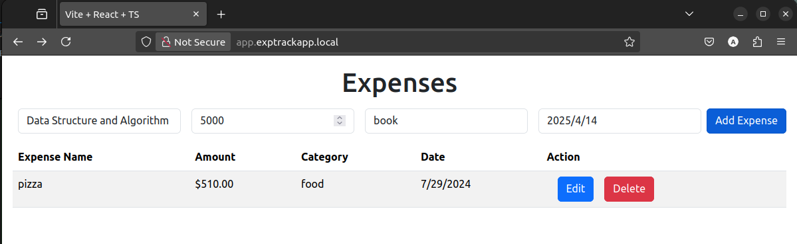
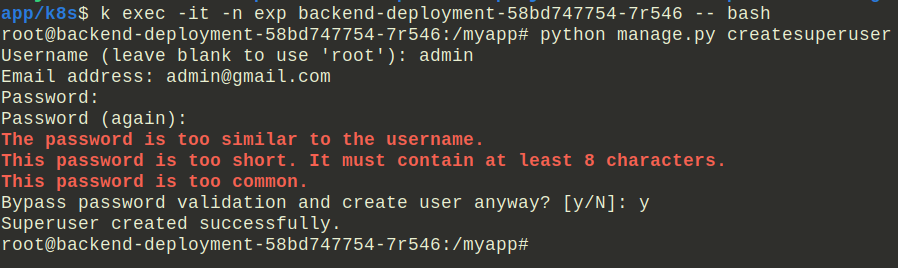
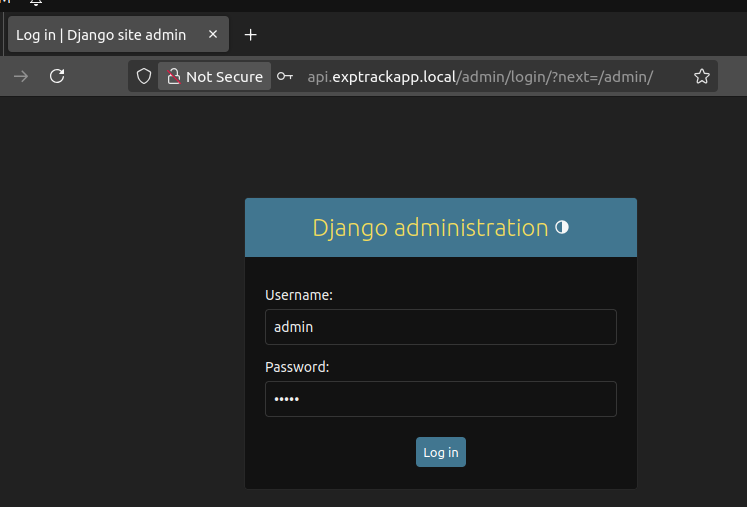
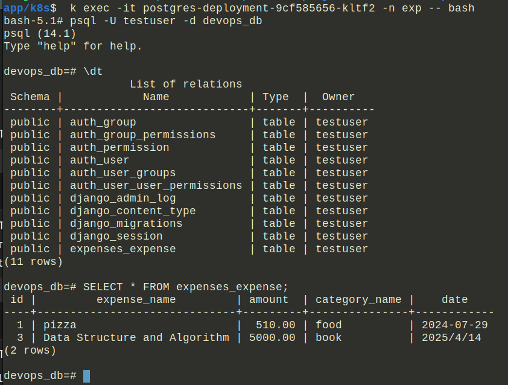
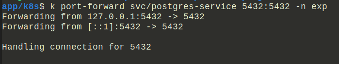
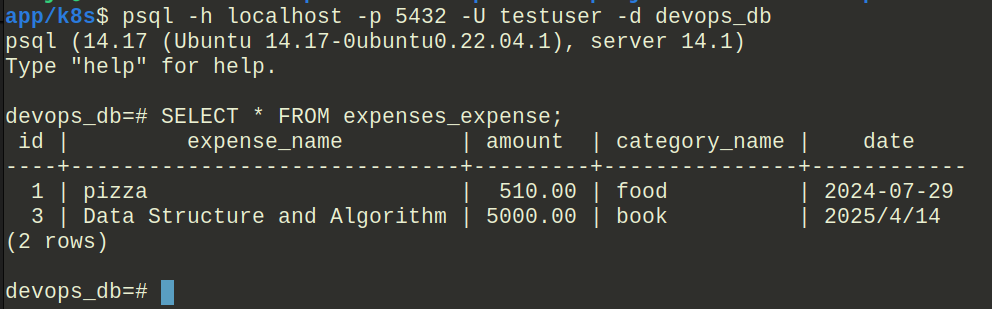
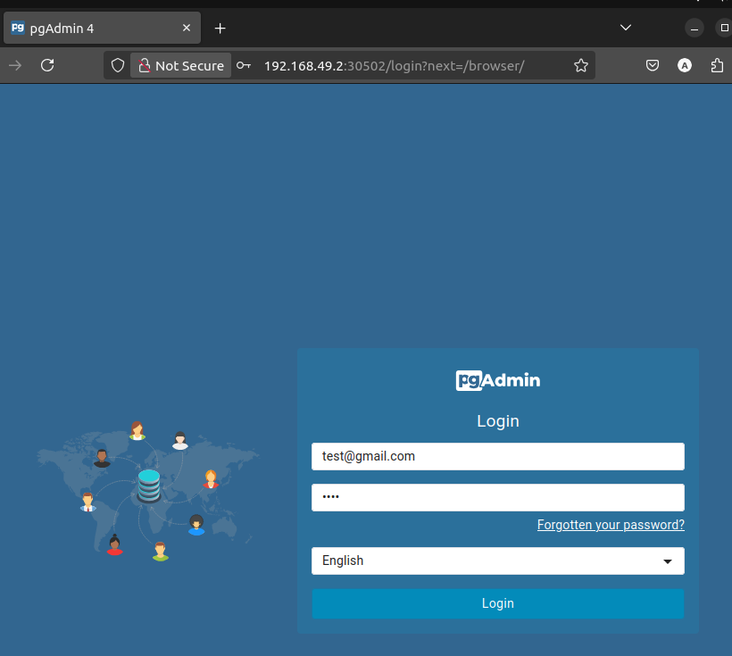
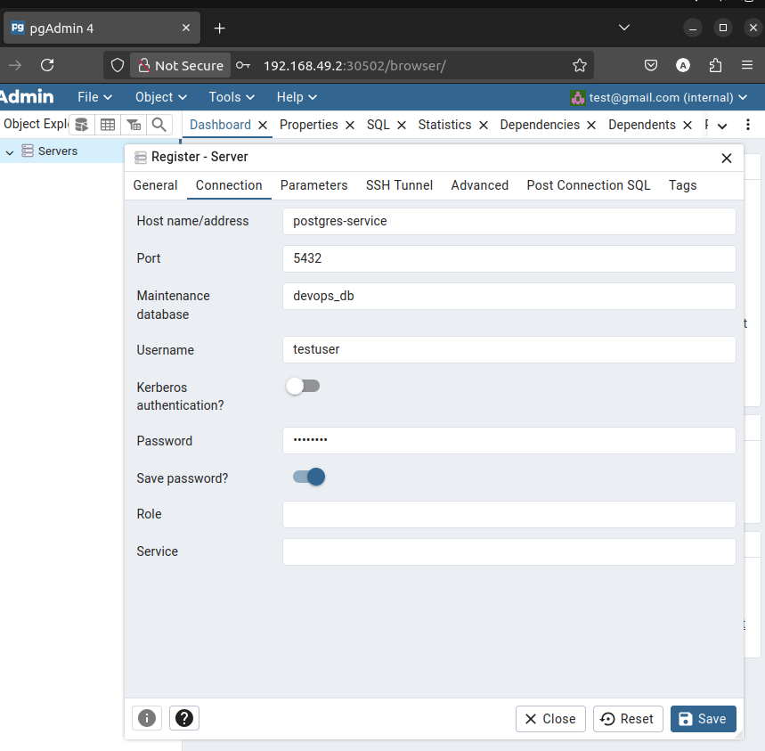
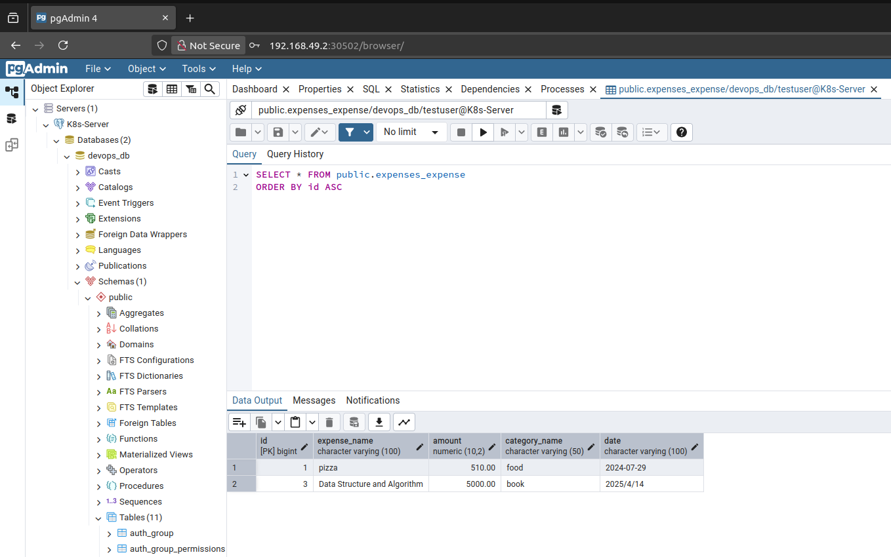

# Full-Stack Expense Tracking App with Kubernetes

## Introduction
This is a simple CRUD application that helps us track our expenses.

- The app is built using **React** for the frontend, **Django REST Framework** (DRF) for the backend, and **PostgreSQL** as the database. The entire stack is deployed using **Kubernetes** for scalability and management.

---

## Technologies Used
- **Frontend**: React.js
- **Backend**: Django Rest Framework
- **Database**: PostgreSQL
- **Database Administration**: pgAdmin
- **Containerization**: Docker
- **Orchestration**: Kubernetes
- **Deployment**: Minikube (local Kubernetes cluster)

---

### 1. **Clone the repository**
Clone the repository to your local machine:
```
git clone git@github.com:alijarai12/django-react-kubernetes-project.git
cd django-react-kubernetes-project
```

---

### 2. **ConfigMap Configuration**
We created ConfigMaps to store and manage application configuration files, which allows the application to pick up changes from the host system without needing to rebuild the container.
Frontend ConfigMap:
```
kubectl create configmap frontend-config \
  --from-file=../django-react-kubernetes-project/src/config.ts \
  --from-file=../django-react-kubernetes-project/vite.config.ts \
  --from-file=../django-react-kubernetes-project/.env \
  -n exp

```

Backend ConfigMap:
```
kubectl create configmap backend-config \
  --from-file=../django-react-kubernetes-project/backend/settings.py \
  -n exp
```

These ConfigMaps ensure that any changes made to the respective host files will automatically propagate into the running container.


## 3. **Backend Setup - Django REST Framework**

### 3.1. **Django Configuration**

The backend uses **Django Rest Framework** for creating RESTful APIs. The settings for database and CORS are configured in the `settings.py` file.
```
    DATABASES = {
        "default": {
            "ENGINE": "django.db.backends.postgresql",
            "NAME": environ.get("PSQL_NAME"),
            "USER": environ.get("PSQL_USER"),
            "PASSWORD": environ.get("PSQL_PASSWORD"),
            "HOST": environ.get("PSQL_SERVICE"),
            "PORT": environ.get("PSQL_PORT"),
        }
    }
```
Key points:

- The PostgreSQL database connection settings are loaded from environment variables.

- CORS (Cross-Origin Resource Sharing) and CSRF (Cross-Site Request Forgery) settings are configured to allow frontend access from certain URLs, including http://app.exptrackapp.local and http://api.exptrackapp.local.


### 3.2. **Kubernetes ConfigMap and Secret for Backend**
In the Kubernetes setup, the ConfigMap and Secret hold sensitive data like database credentials and environment variables for the backend.


- The Kubernetes ConfigMap is used to inject environment variables into the backend service, such as the database name, service, and ports. Below is the configuration for the ConfigMap:
`config-map.yml`
```
    apiVersion: v1
    kind: ConfigMap
    metadata:
    name: configmap
    namespace: exp
    data:
    PSQL_NAME: "devops_db" # database
    PSQL_SERVICE: "postgres-service" # service name of the PostgreSQL container
    PSQL_PORT: "5432" # port for the database service 
```

- Sensitive information, such as the database user and password, are stored in a Kubernetes Secret. Below is the configuration for the Secret:
`secrets.yml`
```
    apiVersion: v1
    kind: Secret
    metadata:
    name: secrets
    namespace: exp
    data:
    PSQL_USER: dGVzdHVzZXI=  # testuser # base64-encoded
    PSQL_PASSWORD: dGVzdHVzZXI=  # testuser # base64-encoded
```

### 3.3. **Backend Ingress Setup**
The Ingress ensures that the backend service is accessible via a specified hostname `api.exptrackapp.local` on port 8000.
`ingress.yml`
```
    apiVersion: networking.k8s.io/v1
    kind: Ingress
    metadata:
    name: exp-track-ingress
    namespace: exp
    spec:
    rules:
    - host: api.exptrackapp.local
        http:
        paths:
        - pathType: Prefix
            path: "/"
            backend:
            service:
                name: backend
                port:
                number: 8000  # Backend service port
```
This configuration allows you to send HTTP requests to the backend API via http://api.exptrackapp.local.

### 3.4. **Backend Service Configuration**
`backend-service.yml`
```
apiVersion: v1
kind: Service
metadata:
  name: backend
  namespace: exp
spec:
  ports:
  - port: 8000
    targetPort: 8000
  selector:
    app: backend  # Should match the backend pod label

```
This service listens on port 8000 and is used by the ingress to route traffic to the backend containers.


### 3.5. **Accessing the Backend**
Once the backend is deployed via Kubernetes, you can access the API at http://api.exptrackapp.local. Ensure that DNS is configured or the hosts file is set up to resolve api.exptrackapp.local to the appropriate IP of your Kubernetes cluster or Minikube IP.


---


## 4. **Frontend Setup - React (Vite)**
The frontend is built using **React** and **Vite** as the build tool. Kubernetes handles the orchestration of the frontend service, while the Vite development server is configured to work with a local API hosted via the backend service.

### 4.1. **Frontend Configuration**
The frontend uses **Vite** to bundle and serve the application. Below is the relevant configuration for Vite in `vite.config.ts`:
```
    import { defineConfig } from 'vite'
    import react from '@vitejs/plugin-react'

    export default defineConfig({
    plugins: [react()],
    
    server: {
        host: '0.0.0.0',    
        port: 5173,
        strictPort: true,   
        hmr: {
        host: "app.exptrackapp.local",
        },
        allowedHosts: ["app.exptrackapp.local"], 
    }
    })
```

Key points:

- The Vite development server is bound to 0.0.0.0 and runs on port 5173.

- Hot Module Replacement (HMR) is configured to work with app.exptrackapp.local.

- The allowedHosts configuration ensures only specific domains (like app.exptrackapp.local) can access the development server.


### 4.2. **Frontend Environment Configuration (.env)**
To connect to the backend API, the frontend uses an environment variable defined in the .env file:
`.env`
```
    VITE_API_URL=http://api.exptrackapp.local/api
```


### 4.3. **Kubernetes ConfigMap for Frontend**
The Kubernetes ConfigMap is used to inject the API URL into the frontend container. Here is the ConfigMap definition:
`config-map.yml`
```
    apiVersion: v1
    kind: ConfigMap
    metadata:
    name: configmap
    namespace: exp
    data:
    VITE_API_URL: "http://api.exptrackapp.local/api"

```

### 4.4. **Kubernetes Ingress for Frontend**
The frontend service is exposed to the outside world via an Ingress configuration in Kubernetes. The Ingress routes traffic from app.exptrackapp.local to the frontend service on port 5173:
`ingress.yml`
```
    apiVersion: networking.k8s.io/v1
    kind: Ingress
    metadata:
    name: exp-track-ingress
    namespace: exp
    labels:
    name: ingress
    spec:
    rules:
    - host: app.exptrackapp.local
        http:
        paths:
        - pathType: Prefix
            path: "/"
            backend:
            service:
                name: frontend
                port:
                number: 5173 # Must match the service port
```
This configuration ensures that requests to app.exptrackapp.local are routed to the frontend service running in Kubernetes.


### 4.5. **Frontend Service Configuration**
The frontend service in Kubernetes must be exposed on port 5173 to match the Vite server configuration. Here's an example service configuration for the frontend:
`frontend-service.yml`
```
    apiVersion: v1
    kind: Service
    metadata:
    name: frontend
    namespace: exp
    spec:
    type: ClusterIP
    selector:
        app: frontend
    ports:
    - protocol: TCP
        port: 5173     # Service port (matches Ingress)
        targetPort: 5173
```


### 4.6. **Accessing the Frontend**
Once the frontend is deployed via Kubernetes, you can access the application at http://app.exptrackapp.local (this assumes that you have configured DNS or hosts file entries to resolve app.exptrackapp.local to the appropriate Minikube IP or Kubernetes cluster IP).

You can view the frontend service and its status by running:
```
    kubectl get services -n exp
```

You can check the ingress routes with:
```
    kubectl get ingress -n exp
```

---

## 5. **PostgreSQL and pgAdmin Setup**
The PostgreSQL database is used to store the application's data, and **pgAdmin** is used as a web interface to manage the database. Both are deployed using **Kubernetes** for scalability and management.

### 1. **PostgreSQL Setup**
The PostgreSQL database is deployed as a container in Kubernetes, and it is responsible for storing all of the application's data. Below is the configuration of the PostgreSQL container in the Kubernetes setup.
`config-map.yml`
```
apiVersion: v1
kind: ConfigMap
metadata:
  name: configmap
  namespace: exp
data:
  POSTGRES_DB: "devops_db"   # The name of the database
  POSTGRES_HOST: "postgres-service"  # The PostgreSQL service name
```
This configuration sets up the database connection details that can be used by other services, such as Django, to interact with the PostgreSQL database.

### 1.1 **Kubernetes Secret for PostgreSQL**
The secret stores base64-encoded values for the username and password, which will be used by PostgreSQL to authenticate connections.
`secrets.yml`
```
    apiVersion: v1
    kind: Secret
    metadata:
    name: secrets
    namespace: exp
    data:
    POSTGRES_USER: dGVzdHVzZXI=  # testuser # base64-encoded
    POSTGRES_PASSWORD: dGVzdHVzZXI= # testuser  # base64-encoded
```
These secrets are used by the PostgreSQL container to authenticate users trying to access the database.


### 1.2 **Accessing PostgreSQL Database**
---

## Access PostgreSQL from Within the Pod
```
kubectl exec -it <postgres_pod_name> -n <namespace> -- bash
```
- Replace <postgres_pod_name> with the actual podname.


Inside the container run the cmd:
```
psql -U <POSTGRES_USER> -d <POSTGRES_DB>
```
- Replace <POSTGRES_USER> with PostgreSQL username 'testuser'.

- Replace <POSTGRES_DB> with database name 'devops_db'.
---

## Access PostgreSQL from Outside Kubernetes (Local Machine)
To access the PostgreSQL database from your local machine, you need to install the PostgreSQL client tools. This is necessary because Kubernetes itself doesn't expose the database externally, but you can forward the port to access it locally.

1. Install PostgreSQL Client Tools
For Ubuntu/Debian:
```
sudo apt-get update
sudo apt-get install postgresql-client
```
2. Port Forwarding PostgreSQL from Kubernetes
To forward the PostgreSQL port from the Kubernetes cluster to your local machine, use the following command:

```
kubectl port-forward svc/<postgres_service_name> 5432:5432 -n <namespace>
```
This command forwards the PostgreSQL service to your local machine's port 5432, making it accessible from outside the Kubernetes cluster.


Now, you can connect using psql or any database client:
```
psql -h localhost -p 5432 -U <POSTGRES_USER> -d <POSTGRES_DB>
```
---

### 2. **pgAdmin Setup**
pgAdmin is a web-based database management tool that allows you to interact with the PostgreSQL database through a graphical interface. 

### 2.1 **Kubernetes Secret for pgAdmin**
In the following Kubernetes configuration, we define a Secret to securely store the credentials required for logging into pgAdmin. The Secret holds the default email and password used to access the pgAdmin interface.

```
apiVersion: v1
kind: Secret
metadata:
  name: pgadmin-secret
  namespace: exp
type: Opaque
data:
  PGADMIN_DEFAULT_EMAIL: dGVzdEBnbWFpbC5jb20= # test@gmail.com  # base64-encoded
  PGADMIN_DEFAULT_PASSWORD: dGVzdA==  # test # base64-encoded

```
The fields are base64 encoded to ensure the credentials are stored securely.  These credentials are injected into the pgAdmin container via environment variables, allowing the user to log in to the pgAdmin interface. The pgAdmin container uses these credentials to provide access to the PostgreSQL database.


### 2.2 **pgAdmin Deployment**
The pgAdmin container is deployed with the necessary configuration for running within the Kubernetes environment. It also includes an initContainer, which is used to adjust the permissions on the pgAdmin session storage directory.
```
    apiVersion: apps/v1
    kind: Deployment
    metadata:
    name: pgadmin
    namespace: exp  # Use the namespace where you are deploying
    spec:
    replicas: 1
    selector:
        matchLabels:
        app: pgadmin
    template:
        metadata:
        labels:
            app: pgadmin
        spec:
        initContainers:
            - name: fix-permissions
            image: busybox
            command: ['sh', '-c', 'chown -R 5050:5050 /var/lib/pgadmin']
            volumeMounts:
                - name: pgadmin-storage
                mountPath: /var/lib/pgadmin

        containers:
            - name: pgadmin
            image: dpage/pgadmin4
            ports:
                - containerPort: 80
            envFrom:
                - secretRef:
                    name: pgadmin-secret
            volumeMounts:
                - name: pgadmin-storage
                mountPath: /var/lib/pgadmin/sessions
        volumes:
            - name: pgadmin-storage
            persistentVolumeClaim:
                claimName: pgadmin-pvc

```

The initContainers section includes a special container (fix-permissions) that runs before the main pgAdmin container starts. This container ensures that the session data directory (/var/lib/pgadmin/sessions) has the correct permissions so that the pgAdmin container can store session data. The command chown -R 5050:5050 /var/lib/pgadmin ensures that the pgAdmin container has the appropriate ownership over this directory, allowing it to write session data.

### 2.3 **pgAdmin Access via NodePort**
In this Kubernetes setup, pgAdmin is exposed using a NodePort service instead of an Ingress resource. This allows you to access the pgAdmin interface directly from your browser by using the IP address of the node and the assigned port.

- NodePort Service for pgAdmin
```
    apiVersion: v1
    kind: Service
    metadata:
    name: pgadmin-service
    namespace: exp
    spec:
    type: NodePort
    selector:
        app: pgadmin
    ports:
        - protocol: TCP
        port: 80
        targetPort: 80
        nodePort: 30502

```

The `NodePort` service exposes the `pgAdmin` container on port `30502` on the node's IP.

When you run the Kubernetes cluster locally with Minikube or on any other local setup, you can access pgAdmin in your browser by navigating to:

- `http://<minikube-ip>:30502` if you're using Minikube.

- `http://<node-ip>:30502` if you're running Kubernetes on a different local setup.

### 2.4 **Accessing pgAdmin**
To access pgAdmin through your browser:
1. Retrieve the Minikube IP (if using Minikube):
```
minikube ip
``` 

2. Open your browser and go to:
```
http://<minikube-ip>:30502
```

3. Log in using the credentials stored in the Kubernetes Secret (pgadmin-secret). The default login credentials are:

- Email: test@gmail.com
- Password: test

Once logged in to pgAdmin, you can add a new server to manage the PostgreSQL database:

Name: Choose any name for the server (e.g., K8s-Server).

Host: postgres-service (this is the name of the PostgreSQL service in Kubernetes).

Database: devops_db

Port: 5432

Username: testuser

Password: testuser

After this, you will be able to view and manage your PostgreSQL database via pgAdmin.


## Screenshots & Results

**Accessing the Frontend**


**Creating a Django Superuser**


**Login with created superuser**


**Accessing the Backend**


**Access PostgreSQL from Within the Pod**



 **Access PostgreSQL from Outside Kubernetes**
 Port Forwarding PostgreSQL from Kubernetes


Connected using psql database client:


 **Accessing pgAdmin through the browser**
Login using the credentials stored in the Kubernetes Secret



Registered a new server to manage the PostgreSQL database:



Data in the devops_db database

